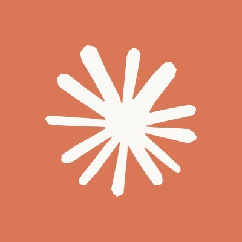
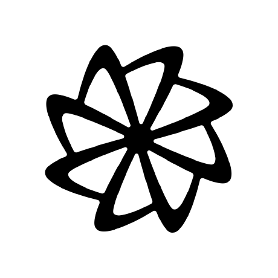
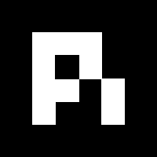
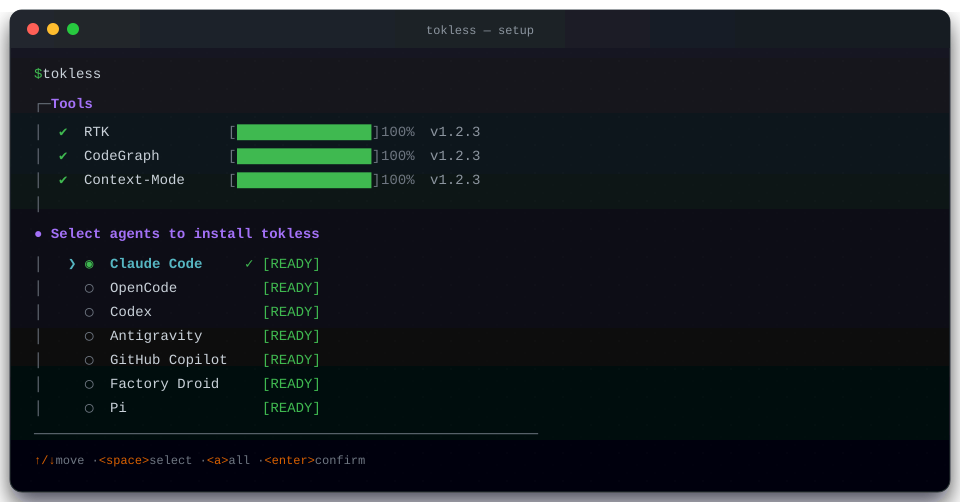

<div align="center">
  

  **A unified pipeline for efficient and effective coding agents.**

  One tool, no config — works the moment it lands.

  [](https://github.com/HoangP8/tokless/releases)
  [](https://github.com/HoangP8/tokless)
  [](https://github.com/HoangP8/tokless/blob/main/LICENSE)

  <br />

</div>

## Introduction

> *Many packages help coding agents work more effectively and efficiently. **The best tools already exist; wiring them well is the real work.** Tokless brings together [specialized tools](#tools), each with a distinct purpose, and manages them with minimal setup.*

<table>
  <tr><td>✅</td><td><b>Clear purpose</b> — best tool for each job, wired without conflict</td></tr>
  <tr><td>✅</td><td><b>No overload</b> — minimal MCP tools with clear, unified instructions</td></tr>
  <tr><td>✅</td><td><b>Zero config</b> — works as soon as installed, in under 30 seconds</td></tr>
  <tr><td>✅</td><td><b>One place</b> — install, update, and manage all tools across every configured agent</td></tr>
</table>

<p align="center"><b>AGENTS</b></p>

<div align="center">
  <table>
    <tr>
      <td align="center" width="140"><a href="https://github.com/anthropics/claude-code"></a><br/><b>Claude Code</b><br/></td>
      <td align="center" width="140"><a href="https://github.com/anomalyco/opencode"></a><br/><b>OpenCode</b><br/></td>
      <td align="center" width="140"><a href="https://github.com/openai/codex"></a><br/><b>Codex</b><br/></td>
      <td align="center" width="140"><a href="https://antigravity.google"></a><br/><b>Antigravity</b><br/></td>
      <td align="center" width="140"><a href="https://github.com/github/copilot-cli"></a><br/><b>GitHub Copilot</b><br/></td>
    </tr>
    <tr>
      <td align="center" width="140"><a href="https://factory.ai"></a><br/><b>Factory Droid</b><br/></td>
      <td align="center" width="140"><a href="https://pi.dev"></a><br/><b>Pi</b><br/></td>
      <td align="center" width="140"><a href="https://cursor.com"></a><br/>Cursor<br/></td>
      <td align="center" width="140"><a href="https://x.ai/cli"><picture><source media="(prefers-color-scheme: dark)" srcset="https://media.x.ai/v1/website/spacexai-symbol-white-transparent-0c31957f.png" /><source media="(prefers-color-scheme: light)" srcset="https://media.x.ai/v1/website/spacexai-symbol-black-transparent-6435cf42.png" /></picture></a><br/>Grok Build<br/></td>
      <td align="center" width="140"><a href="https://kilo.ai/cli"></a><br/>Kilo Code<br/></td>
    </tr>
    <tr>
      <td align="center" width="140"><a href="https://omp.sh/"></a><br/>Oh My Pi<br/></td>
      <td align="center" width="140"><a href="https://cline.bot/"></a><br/>Cline<br/></td>
      <td align="center" width="140">&nbsp;</td>
      <td align="center" width="140">&nbsp;</td>
      <td align="center" width="140">&nbsp;</td>
    </tr>
  </table>
</div>

## Installation

### Manual



**macOS / Linux**

```bash
curl -fsSL https://raw.githubusercontent.com/HoangP8/tokless/main/scripts/install.sh | bash
```

**Windows (PowerShell)**

```powershell
irm https://raw.githubusercontent.com/HoangP8/tokless/main/scripts/install.ps1 | iex
```

Nothing to install first. Node and Python are only needed by some tools, and
tokless installs whatever is missing (Python arrives via `uv`, which brings its
own).

Interactive install detects installed supported agents; choose one, some, or all:

```bash
tokless                              # interactive: pick agents
tokless --agents claude,opencode     # wire just these
```

### Copy this for your agent

```text
https://raw.githubusercontent.com/HoangP8/tokless/main/docs/installation.md
```

## Tools

Popular packages with distinct roles, wired without conflicts.

| Package | ⭐ | Purpose |
| :--- | :---: | :--- |
| [karpathy-skills](https://github.com/multica-ai/andrej-karpathy-skills) |  | Coding principles: think first, simplify, edit surgically, verify. |
| [caveman](https://github.com/JuliusBrussee/caveman) |  | Terse response rules that preserve technical accuracy. |
| [ponytail](https://github.com/DietrichGebert/ponytail) |  | Minimal-code rules: reuse first, avoid speculative work. |
| [rtk](https://github.com/rtk-ai/rtk) |  | Filters command output before it reaches the agent. |
| [codegraph](https://github.com/colbymchenry/codegraph) |  | Indexed code graph for source, call paths, and impact. |
| [context-mode](https://github.com/mksglu/context-mode) |  | Sandboxed context tools with session memory and focused analysis. |
| [headroom](https://github.com/headroomlabs-ai/headroom) |  | Compresses payloads that have to enter context anyway. |
| [projectmem](https://github.com/riponcm/projectmem) |  | Local memory of past issues, fixes, and decisions. |

```text
MCP Tools
├── CodeGraph · 1/1
│   └── codegraph_explore
├── Context Mode · 6/11
│   ├── ctx_execute
│   ├── ctx_batch_execute
│   ├── ctx_execute_file
│   ├── ctx_index
│   ├── ctx_search
│   └── ctx_fetch_and_index
├── Headroom · 3/3
│   ├── headroom_compress
│   ├── headroom_retrieve
│   └── headroom_stats
└── ProjectMem · 15/15
    ├── get_context · precheck_file · get_global_gotchas
    ├── get_instructions · get_summary · get_project_map
    ├── get_plan · get_issue · search_events · get_score
    └── log_issue · record_attempt · record_fix · add_decision · add_note
```

Skill prose (principles, caveman, ponytail) is synced from each upstream repo and
versioned, so `tokless update` picks up changes there too. The copy bundled in the
binary is the offline fallback.

## Configuration

How each tool connects to each agent:

> **Instruction** means Tokless-managed static rules refreshed by `tokless update`.

<table width="1500">
  <thead>
    <tr>
      <th width="130" nowrap>Tool</th>
      <th width="185" nowrap>Claude</th>
      <th width="185" nowrap>OpenCode</th>
      <th width="185" nowrap>Codex</th>
      <th width="220" nowrap>Antigravity</th>
      <th width="220" nowrap>Copilot</th>
      <th width="220" nowrap>Droid</th>
      <th width="225" nowrap>Pi</th>
    </tr>
  </thead>
  <tbody>
    <tr><td nowrap><b>rtk</b></td><td nowrap>Hook + Allow</td><td nowrap>Plugin</td><td nowrap>Hook</td><td nowrap>Hook + Allow</td><td nowrap>Hook + Allow</td><td nowrap>Hook</td><td nowrap>Extension</td></tr>
    <tr><td nowrap><b>caveman</b></td><td nowrap>Instruction</td><td nowrap>Instruction</td><td nowrap>Instruction</td><td nowrap>Instruction</td><td nowrap>Instruction</td><td nowrap>Instruction</td><td nowrap>Instruction</td></tr>
    <tr><td nowrap><b>ponytail</b></td><td nowrap>Instruction</td><td nowrap>Instruction</td><td nowrap>Instruction</td><td nowrap>Instruction</td><td nowrap>Instruction</td><td nowrap>Instruction</td><td nowrap>Instruction</td></tr>
    <tr><td nowrap><b>codegraph</b></td><td nowrap>MCP + Allow + Instruction</td><td nowrap>MCP + Instruction</td><td nowrap>MCP + Instruction</td><td nowrap>Hook + MCP + Instruction</td><td nowrap>Hook + MCP + Instruction</td><td nowrap>Hook + MCP + Instruction</td><td nowrap>MCP + Extension + Instruction</td></tr>
    <tr><td nowrap><b>context-mode</b></td><td nowrap>MCP + Allow + Instruction</td><td nowrap>MCP + Instruction</td><td nowrap>Hook + MCP + Instruction</td><td nowrap>MCP + Instruction</td><td nowrap>MCP + Hook + Instruction</td><td nowrap>MCP + Instruction</td><td nowrap>MCP + Extension + Instruction</td></tr>
    <tr><td nowrap><b>headroom</b></td><td nowrap>MCP + Allow + Instruction</td><td nowrap>MCP + Instruction</td><td nowrap>MCP + Instruction</td><td nowrap>MCP + Instruction</td><td nowrap>MCP + Instruction</td><td nowrap>MCP + Instruction</td><td nowrap>MCP + Extension + Instruction</td></tr>
    <tr><td nowrap><b>projectmem</b></td><td nowrap>MCP + Allow + Instruction</td><td nowrap>MCP + Instruction</td><td nowrap>MCP + Instruction</td><td nowrap>MCP + Instruction</td><td nowrap>MCP + Instruction</td><td nowrap>MCP + Instruction</td><td nowrap>MCP + Extension + Instruction</td></tr>
    <tr><td nowrap><b>principles</b></td><td nowrap>Instruction</td><td nowrap>Instruction</td><td nowrap>Instruction</td><td nowrap>Instruction</td><td nowrap>Instruction</td><td nowrap>Instruction</td><td nowrap>Instruction</td></tr>
  </tbody>
</table>

### Compression proxy (optional)

headroom's MCP tools compress what an agent hands them. Its proxy compresses
every request an agent sends, which saves more, but it runs as a background
service in front of the API and reroutes agents machine-wide. Tokless asks once
during install and remembers your answer:

```
tokless headroom-proxy on       # install the service and route detected agents
tokless headroom-proxy status   # is it up, and what's routed through it
tokless headroom-proxy off      # remove it; agents go back to direct calls
```

## Usage

```
tokless              Install tools, then pick detected agents (safe to re-run)
tokless update       Update the tokless CLI, then show version diff and upgrade tools
tokless doctor       Show what's wired; warn about broken bits
tokless info         Show how tokless was installed, plus paths and config locations
tokless index        Build per-project indexes (codegraph, projectmem)
tokless disable      Disable one or more agents
tokless uninstall    Remove everything tokless touched, including the CLI itself
tokless self-update  Update the tokless CLI itself
tokless --version    Print tokless version
tokless --help       Show all commands and flags

tokless headroom-proxy on|off|status
                     Compress every request an agent sends
```

Flags:
```
--agents <list>   Subset: claude,opencode,codex,antigravity,copilot,droid,pi
--tools <list>    Subset: rtk,principles,caveman,ponytail,codegraph,context-mode,headroom,projectmem
--headroom-proxy  Turn the compression proxy on without asking
--dry-run         Preview, no writes
--verbose         Every step
--yes             Skip confirmations
```

Restart agents after install so they pick up new config.
